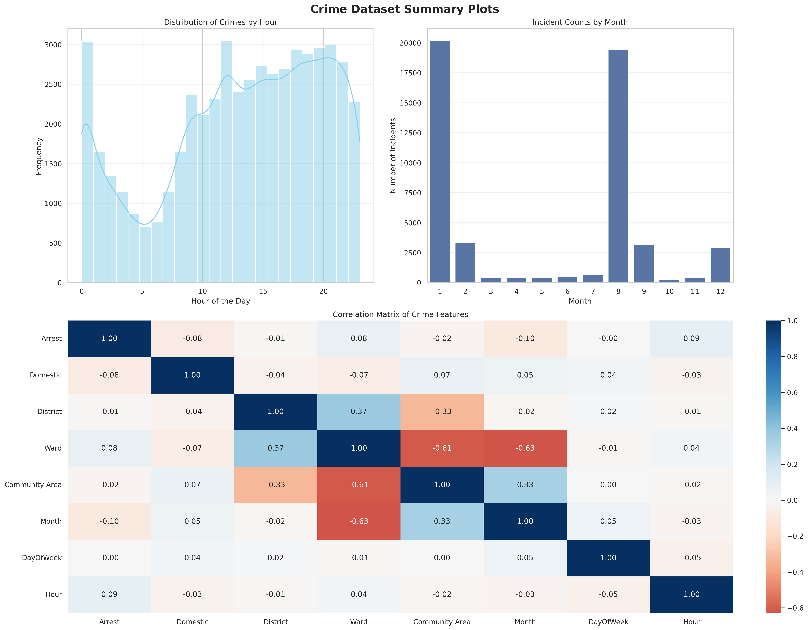

# CSCI461 Assignment 1 - Crime Data Analytics Pipeline

## Course Information

- **Course:** CSCI461 - Introduction to Big Data
- **Assignment:** Assignment #1
- **Semester:** Spring 2026

## Team Members

- Youssef Kandil
- Mahmoud Khaled
- Youssef Alaa
- Ziad Abdelwahab

## Project Overview

This project builds a reproducible big data pipeline for a raw crime dataset. The pipeline starts from a CSV file, performs preprocessing, generates textual insights, creates summary visualizations, and applies K-Means clustering.

The generated outputs are:

- `data_raw.csv`
- `data_preprocessed.csv`
- `insight1.txt`
- `insight2.txt`
- `insight3.txt`
- `summary_plot.png`
- `clusters.txt`

## Expected Submission Structure

```text
customer-analytics/
├── Dockerfile
├── ingest.py
├── preprocess.py
├── analytics.py
├── visualize.py
├── cluster.py
├── summary.sh
├── README.md
└── results/
```

## Important Note

In the current workspace, the Docker support files are not yet placed exactly as required by the assignment:

- `Big data Assignement 1/Docker/Dockerfile.txt` should be renamed and moved to `Dockerfile`
- `Big data Assignement 1/Docker/ingest.py` should be moved to the project root as `ingest.py`
- `Cluster.py` should be renamed to `cluster.py`

Before final submission, make sure the filenames match the assignment exactly.

## Technologies Used

- Python 3.11
- pandas
- numpy
- matplotlib
- seaborn
- scikit-learn
- scipy
- requests
- Docker

## Docker Build And Run Commands

After arranging the files in the final required structure, use:

```bash
docker build -t customer-analytics .
docker run -it --name customer-analytics-run customer-analytics
```

Do not use `--rm` here, because `summary.sh` needs the container to still exist in order to copy the output files.

## Execution Flow

The intended pipeline flow is:

```text
ingest.py -> preprocess.py -> analytics.py -> visualize.py -> cluster.py
```

The execution order used for this project is:

1. `ingest.py` reads the raw dataset path from the command line and saves a copy as `data_raw.csv`.
2. `preprocess.py` loads the latest CSV file, removes unnecessary columns, fills missing values, removes duplicates, extracts time features, and encodes grouped categorical values.
3. `analytics.py` generates textual insights and saves them as `insight1.txt`, `insight2.txt`, and `insight3.txt`. In the current codebase, `preprocess.py` already calls `analytics.py` automatically.
4. `visualize.py` generates a summary figure containing the distribution of crimes by hour, incident counts by month, and a correlation heatmap.
5. `cluster.py` applies K-Means clustering on numeric features and writes the cluster output to `clusters.txt`.
6. `summary.sh` copies all `.csv`, `.txt`, and `.png` outputs from the container to the host `results/` directory, then stops and removes the container.

## Example Commands Inside The Container

After opening the container shell, run the pipeline in this order:

```bash
python ingest.py <path_to_raw_dataset.csv>
python preprocess.py data_raw.csv
python visualize.py data_preprocessed.csv
python cluster.py
```

Then, on the host machine:

```bash
chmod +x summary.sh
./summary.sh customer-analytics-run
```

## Output Description

### 1. Raw And Processed Data

- `data_raw.csv`: exact copy of the input dataset
- `data_preprocessed.csv`: cleaned and transformed dataset used by the later stages

### 2. Textual Insights

The current generated insights are:

```text
insight1.txt
The most frequent crime in the dataset is THEFT, with 10,780 incidents out of 52,025 total records (20.72%). The second most common category is BATTERY with 8,997 incidents (17.29%).

insight2.txt
Public locations contain the largest share of incidents, with 20,086 records (38.61%). The busiest hour is 12:00, when 3,053 incidents were recorded. Friday is the peak day with 8,379 incidents (16.11%).

insight3.txt
The overall arrest rate in the dataset is 28.23%. Among crime categories with at least 500 incidents, PROSTITUTION has the highest arrest rate at 100.00% across 560 cases.
```

### 3. Visualization

The file `summary_plot.png` contains the three required plots in one summary image.



### 4. Clustering Output

`clusters.txt` contains the K-Means clustering output. Example excerpt:

```text
Top features for Cluster 0:
Year                                     2009.164276
Beat                                     383.263083
Latitude                                 41.768830
Community Area                           37.981949
Ward                                     24.798343
Hour                                     13.230013
Month                                    5.378595
District                                 3.617633
```

## Results Collection

The `summary.sh` script:

- copies all generated `.csv`, `.txt`, and `.png` files from `/app/pipeline/`
- saves them into `results/` on the host
- stops the running container
- removes the container afterward

## Reproducibility Notes

- The pipeline is designed to run inside a Docker container based on `python:3.11-slim`.
- The dataset should be raw and not pre-cleaned, as required in the assignment instructions.
- All outputs can be regenerated by running the same containerized workflow again.

## Final Checklist Before Submission

- Rename and place files exactly as required in the assignment
- Ensure `results/` contains the generated `.csv`, `.txt`, and `.png` files
- Include this README inside the final `customer-analytics/` folder
- Verify all team members understand each stage of the pipeline before the discussion
